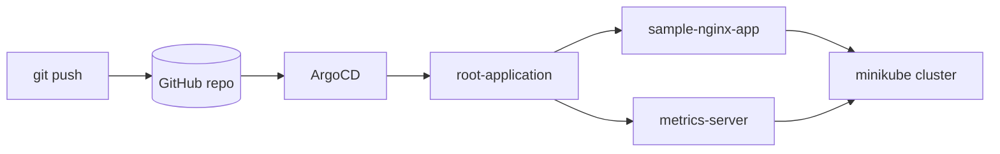
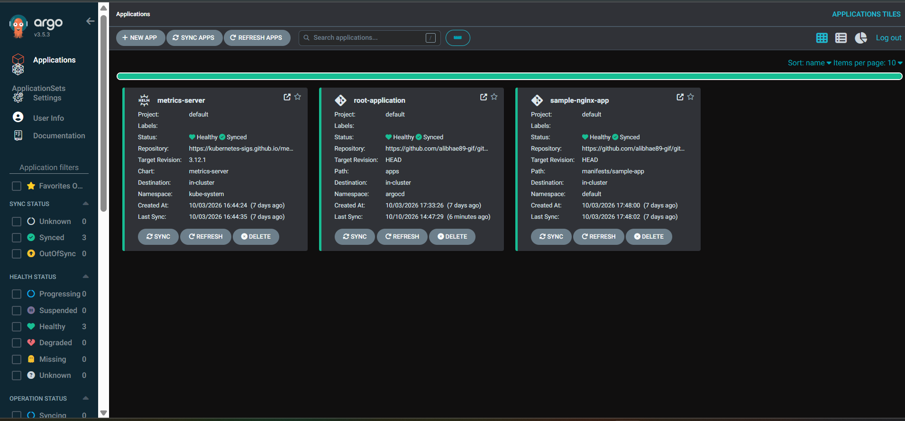
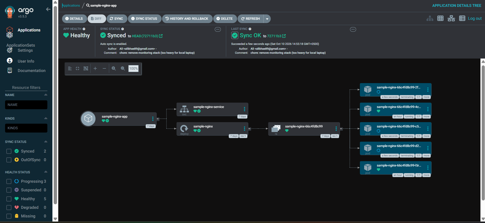

# gitops-manifests

GitOps on a local Kubernetes cluster (minikube) using **ArgoCD** and the **app-of-apps** pattern. Everything running in the cluster is declared in this repo. ArgoCD keeps the cluster in sync with Git, with auto-sync, pruning, and self-healing enabled.

## How it works



1. `bootstrap/root-app.yaml` creates one ArgoCD Application, `root-application`.
2. It watches the `apps/` folder, where each file defines a child Application.
3. Child apps deploy the actual workloads: a sample nginx app (2 replicas) and metrics-server (Helm chart).
4. Change anything in Git and ArgoCD applies it. Change something by hand in the cluster and ArgoCD reverts it.

## Repo layout

```
bootstrap/root-app.yaml     # app-of-apps entry point
apps/                       # one ArgoCD Application per workload
  metrics-server.yaml
  sample-app.yaml
manifests/sample-app/       # Deployment + Service for the sample nginx app
docs/screenshots/           # images used in this README
```

## Quick start

```bash
minikube start
kubectl create namespace argocd
kubectl apply -n argocd --server-side -f https://raw.githubusercontent.com/argoproj/argo-cd/stable/manifests/install.yaml
kubectl apply -f bootstrap/root-app.yaml
```

Open the ArgoCD UI:

```bash
kubectl port-forward svc/argocd-server -n argocd 8080:443
kubectl -n argocd get secret argocd-initial-admin-secret -o jsonpath="{.data.password}" | base64 -d; echo
```

Go to https://localhost:8080 and log in as `admin`.

## Screenshots

**ArgoCD: all applications Healthy and Synced**



**Sample nginx app**



**Root application (app-of-apps)**


**metrics-server (Helm)**


## Self-healing demo

```bash
kubectl scale deploy sample-nginx --replicas=5   # manual change
kubectl get pods -l app=sample-nginx -w          # ArgoCD reverts it to 2 replicas
```

## Lessons learned

- Added a full Prometheus + Grafana stack (kube-prometheus-stack) through ArgoCD, but it was too heavy for an 8 GB laptop running WSL, which caused API timeouts and Pending pods. I removed it and sized the cluster to fit.
- Cluster memory limits for minikube are fixed at creation, so resource planning has to happen before deploying.
